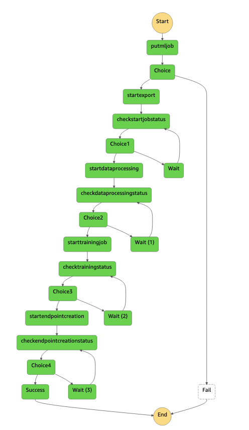

## Neptune ML Ops

Amazon Neptune ML is a new capability of Neptune that uses Graph Neural Networks (GNNs), a machine learning technique purpose-built for graphs, to make easy, fast, and more accurate predictions using graph data. 
With Neptune ML, you can improve the accuracy of most predictions for graphs by over 50% when compared to making predictions using non-graph methods.

## Neptune ML State Machine

